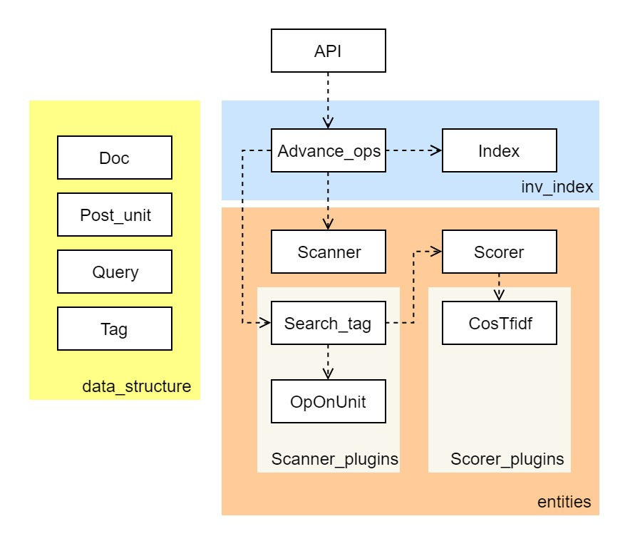

# movie recommendation  
### Introduction  
This project involves developing an algorithm for recommending the related movies based on the given one, in order to do that, I have developed an search engine prototype with an inverted-index as the core, and using the Tfidf and cosine similarity to scoring the documents. The data this engine makes use of are the tags dataset tags.csv and movie information dataset movies.csv, to be more specific, the inverted-index is constructed based on the tags data, and recommendation is made by firstly mapping the movie to its tags and then using these tags to conduct the searching.  
### Architecture  
The architecture of this project refers to and modifies from my previous work toyEngine (Which is written with Java and could be found at https://github.com/wyangla/toyEngine), the main differences between these two projects are: a) how the intermediate information is stored and accessed, use the computed Tfidf value of each posting unit as an example, in this project they are temporarily maintained by the posting unit itself, however, in project toyEngine these kind of information are maintained by independent HashMaps controlled by the entity called information_manager; b) this project does not consider the real time units adding and removing, so that there is no complicated locking and units deactivation mechanism implemented  
  
*More details could be found in documentation /movie_recommendation.pdf*  
